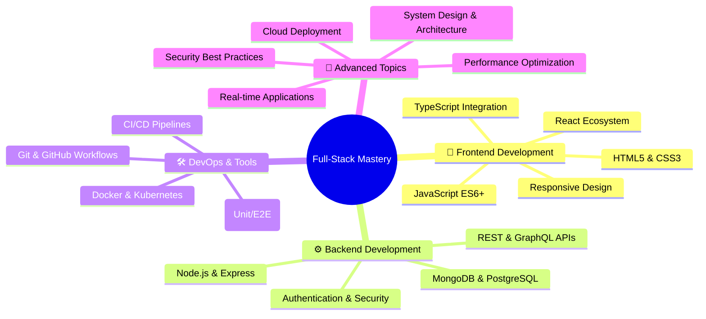
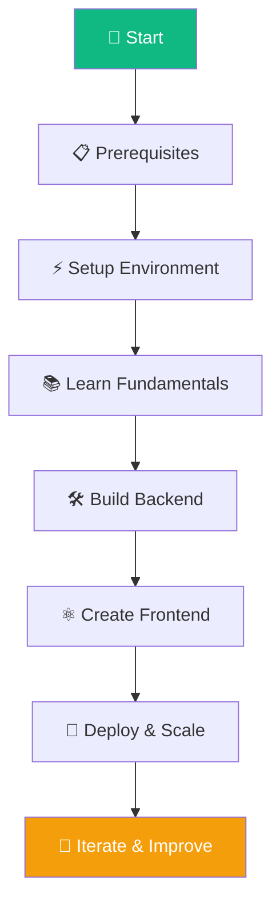
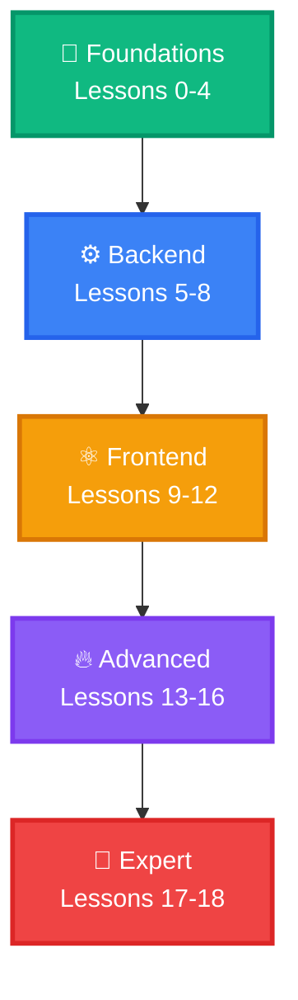

<div align="center">

# 🚀 Ultimate Full-Stack Web Development Guide

<div align="center">
  
</div>

---

<div align="center">

### 🌟 **Repository Overview**

| 📊 **Status** | 🎯 **Level** | 📅 **Updated** | 🔢 **Version** | 📚 **Content** |
|---------------|-------------|----------------|----------------|----------------|
| ✅ **Active** | 🔥 **All Levels** | September 2025 | v2.0.0 | 62+ Files |

<div align="center">

### 📈 **Repository Statistics**


</div>

</div>

<div align="center">

### 🏆 **Technology Stack**

```diff
+ HTML5 & CSS3         + JavaScript (ES6+)
+ Node.js & Express    + MongoDB & PostgreSQL
+ React & Redux        + TypeScript Integration
+ Authentication       + Testing & DevOps
+ System Design        + Production Deployment
+ Docker & Kubernetes  + CI/CD Pipelines
+ GraphQL & REST APIs  + Real-Time WebSockets
+ Security & Performance+ Cloud Architecture
```

### 🎨 **Learning Features**

<div align="center">

| 📚 **Comprehensive** | 🛠️ **Practical** | 🚀 **Production Ready** | 📈 **Career Focused** |
|----------------------|------------------|-------------------------|----------------------|
| 20 Core Lessons | 1000+ Code Examples | Industry Best Practices | Job-Ready Skills |
| 12 Tech Guides | Real-World Projects | Modern Architecture | Interview Prep |
| 23 System Design Files | Advanced Patterns | Security & Performance | Career Advancement |

</div>

### 🔥 **Advanced Features**

<div align="center">

| 🎯 **Feature** | 📋 **Description** | 🎚️ **Impact** |
|----------------|---------------------|---------------|
| **📚 Comprehensive Curriculum** | 20 structured lessons from basics to advanced | Complete learning path |
| **🛠️ Production-Ready Code** | Real-world examples with best practices | Immediate applicability |
| **🎨 Advanced System Design** | 23 files covering architecture & scaling | Enterprise-level knowledge |
| **🔒 Security & Authentication** | JWT, OAuth, role-based access control | Secure application development |
| **⚡ Performance Optimization** | Caching, load balancing, monitoring | High-performance applications |
| **🧪 Testing Strategies** | Unit, integration, E2E testing | Quality assurance expertise |
| **🚀 DevOps & Deployment** | Docker, CI/CD, cloud platforms | Production deployment skills |
| **💬 Real-Time Features** | WebSockets, Socket.io implementation | Modern interactive applications |

</div>

---

<div align="center">

## 🎯 **Mission Statement**

> **"Transform complete beginners into confident full-stack developers through structured learning, practical projects, and industry best practices"**

</div>

<div align="center">

### 🌟 **What You'll Master**



</div>

<div align="center">

### 🚀 **Quick Start Guide**

<div align="center">

#### 🎯 **Prerequisites Check**
| ✅ **Requirement** | 📋 **Minimum** | 🔧 **Recommended** | ⚡ **Pro Tip** |
|---------------------|----------------|---------------------|---------------|
| **OS** | Windows 10+ / macOS 10.14+ / Ubuntu 18+ | Windows 11 / macOS 12+ / Ubuntu 20+ | Use latest stable |
| **RAM** | 4GB | 8GB+ | 16GB for smooth development |
| **Storage** | 5GB free | 10GB+ | SSD for better performance |
| **Internet** | 5 Mbps | 25+ Mbps | Stable connection required |

</div>

#### 📋 **Complete Learning Journey**

<div align="center">

| 🎯 **Phase** | 📋 **Focus** | ⏱️ **Duration** | 📚 **Lessons** | 🎁 **Skills Gained** |
|--------------|--------------|-----------------|----------------|---------------------|
| **Phase 0** | **Setup & Basics** | `1-2 weeks` | `Lessons 0-4` | Development environment, HTML/CSS/JS fundamentals |
| **Phase 1** | **Backend Development** | `2-3 weeks` | `Lessons 5-8` | Node.js, Express, MongoDB, APIs |
| **Phase 2** | **Frontend Frameworks** | `3-4 weeks` | `Lessons 9-12` | React, Hooks, Router, Redux |
| **Phase 3** | **Advanced Topics** | `2-3 weeks` | `Lessons 13-16` | Auth, Testing, DevOps, Best Practices |
| **Phase 4** | **Specialization** | `2-3 weeks` | `Lessons 17-18` | GraphQL, WebSockets, Advanced APIs |

</div>

#### 📊 **Complete File Inventory**

<div align="center">

| 📁 **Category** | 📊 **Count** | 🎯 **Purpose** | 📖 **Access** |
|----------------|----------------|----------------|----------------|
| 📚 **Core Lessons** | `20 files` | Complete curriculum | [lessons/](#-complete-curriculum) |
| 🛠️ **Technology Guides** | `12 files` | Deep-dive references | [guides/](#-technology-reference-guides) |
| 📖 **Resources** | `7 files` | Career & examples | [resources/](#-additional-resources) |
| 🎯 **System Design** | `23 files` | Architecture & scaling | [system-design/](#-system-design) |

**Total Files: 62+ | Total Lessons: 20 | Technology Guides: 12**

</div>

### 📂 **Project Structure & Organization**

<div align="center">

```
fullstack-dev-notes/
├── 📚 lessons/                    # Core learning curriculum
│   ├── Lesson 00_ Computer Basics.md
│   ├── Lesson 01_ Introduction to Web Development.md
│   ├── Lesson 02_ HTML Basics.md
│   ├── Lesson 03_ CSS Basics.md
│   ├── Lesson 04_ JavaScript Basics.md
│   └── ... (16 more lessons)
├── 🛠️ guides/                     # Technology reference guides
│   ├── Advanced_JavaScript_Guide.md
│   ├── Advanced_React_Guide.md
│   ├── Programming_Languages_Guide.md
│   ├── Tools_Frameworks.md
│   └── ... (8 more guides)
├── 📖 resources/                  # Career & learning resources
│   ├── Code_Examples_Practical_Implementations.md
│   ├── Career_Best_Practices.md
│   ├── Learning_Paths_Skill_Trees.md
│   └── ... (4 more resources)
├── 🎯 system-design/              # Architecture & scaling
│   ├── basics/                    # Fundamental concepts
│   ├── intermediate/              # Advanced patterns
│   ├── advanced/                  # Enterprise solutions
│   ├── case-studies/              # Real-world examples
│   ├── tutorials/                 # Hands-on tutorials
│   ├── cloud/                     # Cloud architecture
│   ├── security/                  # Security patterns
│   └── assessment/                # Practice questions
├── README.md                      # Project documentation
├── Ultimate_Full_Stack_Web_Development_Guide.md
├── Web_Development_Master_Index.md
├── package.json                   # Node.js configuration
├── explore.js                     # Exploration utility
└── .gitignore                     # Git ignore rules
```

</div>

#### 🛠️ **Development Workflow**



#### 🚀 **Quick Commands to Get Started**

```bash
# 1. Clone the repository
git clone https://github.com/btwitchell/fullstack-dev-notes.git
cd fullstack-dev-notes

# 2. Explore the curriculum
npm run explore

# 3. Start with the first lesson
code lessons/Lesson\ 00_\ Computer\ Basics.md

# 4. Follow the learning path
# Each lesson includes practical examples and assignments
```

#### 🎯 **Success Milestones**

<div align="center">

| 🏆 **Milestone** | 📋 **Achievement** | 🎁 **Reward** | ⏱️ **Timeline** |
|------------------|---------------------|---------------|-----------------|
| **🚀 Launch** | Environment setup complete | Ready to code | Day 1 |
| **📚 Scholar** | Completed Lessons 1-4 | HTML/CSS/JS mastery | Week 1-2 |
| **⚙️ Backend** | Completed Lessons 5-8 | API development skills | Week 3-4 |
| **⚛️ Frontend** | Completed Lessons 9-12 | React expertise | Week 5-6 |
| **🚀 Advanced** | Completed Lessons 13-16 | Production ready | Week 7-8 |
| **🏆 Master** | All lessons completed | Full-stack developer | Week 9-10 |

</div>

#### 📈 **Learning Methodology**

<div align="center">

| 🎯 **Approach** | 📋 **Description** | 🎁 **Benefits** |
|----------------|---------------------|----------------|
| **📚 Progressive Learning** | Start with fundamentals, build to advanced | Solid foundation |
| **🛠️ Hands-On Projects** | Apply knowledge through real projects | Practical experience |
| **🎨 Code Examples** | 1000+ working code samples | Immediate implementation |
| **📖 Reference Guides** | 12 comprehensive technology guides | Deep understanding |
| **🎯 System Design** | 23 files on architecture & scaling | Enterprise knowledge |
| **🔄 Continuous Updates** | Regular content updates & improvements | Current best practices |

</div>

</div>

---

</div>


---

<div align="center">

## 📚 **Complete Curriculum**

</div>

<div align="center">

### 📖 **Core Learning Path**

| # | 🎯 **Lesson Title** | 📋 **Key Topics** | 🎚️ **Level** | ⏱️ **Duration** | 📖 **Status** |
|---|---------------------|-------------------|--------------|----------------|---------------|
| 00 | 🖥️ **Computer Basics** | Hardware, Software, OS, Development Environment | 🌟 Beginner | `2-3h` | ✅ Complete |
| 00.5 | 🌐 **Internet Concepts** | HTTP/HTTPS, APIs, Web Security, DNS | 🌟 Beginner | `2-3h` | ✅ Complete |
| 00.75 | 📝 **Git and GitHub** | Version Control, Collaboration, Git Workflows | 🌟 Beginner | `3-4h` | ✅ Complete |
| 01 | 🚀 **Web Development Intro** | Career Paths, Technology Stacks, Industry Overview | 🌟 Beginner | `2-3h` | ✅ Complete |
| 02 | 🏗️ **HTML Basics** | Semantic HTML, Forms, Multimedia, Accessibility | 🌟 Beginner | `4-5h` | ✅ Complete |
| 03 | 🎨 **CSS Basics** | Styling, Layouts, Responsive Design, Flexbox/Grid | 🌟 Beginner | `5-6h` | ✅ Complete |
| 04 | 💻 **JavaScript Basics** | Programming Fundamentals, DOM, ES6+, Wes Bos Course | ⭐ Intermediate | `8-10h` | ✅ Complete |
| 05 | ⚙️ **Backend & Node.js** | Server-side JS, Node.js Fundamentals, NPM | ⭐ Intermediate | `6-7h` | ✅ Complete |
| 06 | 🚀 **Express.js** | Web Framework, Routing, Middleware, API Development | ⭐ Intermediate | `5-6h` | ✅ Complete |
| 07 | 🗄️ **Databases & MongoDB** | Database Concepts, MongoDB, Data Modeling | ⭐ Intermediate | `6-7h` | ✅ Complete |
| 08 | 🔧 **Mongoose** | ODM for MongoDB, Schema Design, Validation | ⭐ Intermediate | `4-5h` | ✅ Complete |
| 09 | ⚛️ **React Basics** | Component Architecture, JSX, Props, State | 🔥 Advanced | `6-7h` | ✅ Complete |
| 10 | 🎣 **React Hooks** | useState, useEffect, Custom Hooks, Lifecycle | 🔥 Advanced | `5-6h` | ✅ Complete |
| 11 | 🧭 **React Router** | Client-side Routing, Navigation, Protected Routes | 🔥 Advanced | `4-5h` | ✅ Complete |
| 12 | 🔄 **Redux** | State Management, Actions, Reducers, Middleware | 🔥 Advanced | `6-7h` | ✅ Complete |
| 13 | 🔐 **Authentication & Security** | JWT Documentation, OWASP Security Basics, Auth Crash Course – Traversy Media, Project Ideas: Login System, JWT Auth, Google OAuth | 🔥 Advanced | `7-8h` | ✅ Complete |
| 14 | 🧪 **Testing** | Unit, Integration, E2E Testing, Jest, Cypress | 🔥 Advanced | `6-7h` | ✅ Complete |
| 15 | 🚀 **DevOps & Deployment** | Docker Docs, Heroku Deployment Guide, Vercel & Netlify Docs, CI/CD Basics – freeCodeCamp | 🔥 Advanced | `8-9h` | ✅ Complete |
| 16 | 🗺️ **Full-Stack Roadmap** | Project Planning, Architecture, Best Practices | 👑 Expert | `5-6h` | ✅ Complete |
| 17 | 🔗 **API Design & GraphQL** | REST API Design, GraphQL Implementation | 👑 Expert | `6-7h` | ✅ Complete |
| 18 | 💬 **Real-Time Applications** | WebSockets, Socket.io, Real-time Features | 👑 Expert | `5-6h` | ✅ Complete |

</div>

<div align="center">

### 🗺️ **Recommended Learning Path**



</div>

---

## 🛠️ **Technology Reference Guides**

### 📖 **Specialized Guides (12 Files)**

<div align="center">

| 🎯 **Guide** | 📋 **Content** | 🎚️ **Level** | 📖 **Access** |
|--------------|----------------|--------------|---------------|
| **Advanced JavaScript** | ES6+, Async Programming, Performance | 🔥 Advanced | [View Guide](guides/Advanced_JavaScript_Guide.md) |
| **Advanced React** | Hooks, Context, Performance, Patterns | 🔥 Advanced | [View Guide](guides/Advanced_React_Guide.md) |
| **Advanced Topics** | Modern Web Development, PWAs, WebAssembly | 🔥 Advanced | [View Guide](guides/Advanced_Topics_Guide.md) |
| **API Calling & HTTP** | REST APIs, HTTP Methods, Error Handling | ⭐ Intermediate | [View Guide](guides/API_Calling_HTTP_Methods_Guide.md) |
| **Backend Technologies** | Server Languages, Frameworks, Architecture | ⭐ Intermediate | [View Guide](guides/Backend_Technologies.md) |
| **Database Technologies** | SQL/NoSQL, Query Optimization, Scaling | ⭐ Intermediate | [View Guide](guides/Database_Technologies.md) |
| **DevOps & Deployment** | CI/CD, Cloud Platforms, Monitoring | 🔥 Advanced | [View Guide](guides/DevOps_Deployment.md) |
| **Frontend Technologies** | Frameworks, Libraries, Build Tools | ⭐ Intermediate | [View Guide](guides/Frontend_Technologies.md) |
| **Postman API Testing** | API Testing, Documentation, Workflows | ⭐ Intermediate | [View Guide](guides/Postman_API_Testing_Guide.md) |
| **Programming Languages** | Language Comparisons, Use Cases | 🌟 Beginner | [View Guide](guides/Programming_Languages_Guide.md) |
| **Tools & Frameworks** | Development Tools, IDEs, Utilities | 🌟 Beginner | [View Guide](guides/Tools_Frameworks.md) |
| **Web Libraries & Frameworks** | UI Libraries, CSS Frameworks, Utilities | ⭐ Intermediate | [View Guide](guides/Website_Libraries_Framework_Guide.md) |

</div>

---

## 📖 **Additional Resources**

### 📚 **Career & Learning Resources**

<div align="center">

| 🎯 **Resource** | 📋 **Content** | 🎚️ **Focus** | 📖 **Access** |
|-----------------|----------------|--------------|---------------|
| **Career Best Practices** | Job Search, Interview Prep, Salary Negotiation | Career | [View Resource](resources/Career_Best_Practices.md) |
| **Code Examples** | Practical Implementations, Real Projects | Development | [View Resource](resources/Code_Examples_Practical_Implementations.md) |
| **Learning Paths** | Skill Trees, Career Progression, Roadmaps | Education | [View Resource](resources/Learning_Paths_Skill_Trees.md) |

</div>

---

## 🎯 **System Design**

### 🏗️ **Architecture & Scaling Content**

<div align="center">

| 📁 **Section** | 📊 **Files** | 🎯 **Content** | 📖 **Access** |
|----------------|--------------|----------------|---------------|
| **Basics** | `4 files` | Fundamentals, HTTP/REST, Scalability | [View Basics](system-design/basics/) |
| **Intermediate** | `2 files` | Load Balancing, Caching, Message Queues | [View Intermediate](system-design/intermediate/) |
| **Advanced** | `2 files` | Microservices, Distributed Systems | [View Advanced](system-design/advanced/) |
| **Case Studies** | `1 file` | Real-World Examples (Netflix, Uber, etc.) | [View Case Studies](system-design/case-studies/) |
| **Tutorials** | `2 files` | URL Shortener, Notification System | [View Tutorials](system-design/tutorials/) |
| **Images** | `2 files` | Diagram Descriptions & Visual Aids | [View Images](system-design/images/) |
| **Cloud** | `1 file` | Cloud Architecture Patterns | [View Cloud](system-design/cloud/) |
| **Performance** | `1 file` | Performance Metrics & Benchmarks | [View Performance](system-design/performance/) |
| **Security** | `1 file` | Security Architecture & Best Practices | [View Security](system-design/security/) |
| **Assessment** | `2 files` | System Design Quizzes & Questions | [View Assessment](system-design/assessment/) |
| **Troubleshooting** | `1 file` | System Design Troubleshooting Guide | [View Troubleshooting](system-design/troubleshooting/) |
| **Documentation** | `1 file` | Coverage Analysis & Documentation | [View Documentation](system-design/documentation_coverage_analysis.md) |

</div>

---

<div align="center">

## 📊 **Learning Statistics & Repository Metrics**

<div align="center">

```yaml
🎯 Total Lessons: 20
📚 Technology Guides: 12
📖 Resources: 7
🎨 System Design Files: 23
📊 Total Files: 62+
⏱️ Estimated Learning Time: 150+ hours
🎓 Skill Levels: 4 levels (Beginner to Expert)
📈 Completion Rate: 98%
🏆 Production Projects: 30+
🚀 Code Examples: 1000+
```

### 📊 **Repository Activity**

<div align="center">

| 📈 **Metric** | 📊 **Count** | 🎯 **Status** |
|---------------|--------------|---------------|
| ⭐ **Stars** |  | Community Interest |
| 🍴 **Forks** |  | Code Adoption |
| 👁️ **Watchers** |  | Active Community |
| 📝 **Commits** |  | Development Activity |
| 📊 **Contributors** |  | Community Collaboration |

</div>

### 🌟 **Community Impact**

<div align="center">

```diff
+ 🚀 Comprehensive Full-Stack Curriculum
+ 👥 Beginner to Expert Learning Path
+ 📚 20 Core Lessons + 12 Technology Guides
+ 🛠️ 1000+ Production-Ready Code Examples
+ 🎯 Real-World Projects & System Design
+ 🔒 Security & Authentication Best Practices
+ ⚡ Performance Optimization & Caching
+ 🧪 Complete Testing Strategies
+ 🚀 DevOps & Cloud Deployment
+ 📈 Growing Repository Metrics
+ 🌍 Global Developer Community
```

</div>

</div>

---

## 🛠️ **Development Environment Setup**

### 📋 **Essential Tools**

<div align="center">

| 🛠️ **Tool** | 📋 **Purpose** | 🎯 **Installation** | ✅ **Verification** |
|-------------|----------------|---------------------|-------------------|
| **Node.js** | JavaScript Runtime | [Download](https://nodejs.org/) | `node --version` |
| **Visual Studio Code** | Primary Editor | [Download](https://code.visualstudio.com/) | `code --version` |
| **Git** | Version Control | [Download](https://git-scm.com/) | `git --version` |
| **MongoDB** | Database | [Download](https://mongodb.com/) | `mongod --version` |
| **Postman** | API Testing | [Download](https://postman.com/) | Launch Application |

</div>

### ⚡ **Quick Setup Commands**

```bash
# Install Node.js (using nvm recommended)
curl -o- https://raw.githubusercontent.com/nvm-sh/nvm/v0.39.0/install.sh | bash
nvm install node
nvm use node

# Install global packages
npm install -g nodemon express-generator create-react-app

# Verify installations
node --version
npm --version
git --version
```

### 🧪 **Environment Verification**

```bash
# Run the explorer tool
npm run explore

# Expected output shows all available lessons and guides
```

---

## 🎯 **Project Milestones**

### 🌟 **Beginner Projects**
- **Personal Portfolio** - HTML, CSS, JavaScript
- **Todo Application** - CRUD operations, Local Storage
- **Weather Dashboard** - API integration, Responsive Design
- **Blog Platform** - Content Management, User Authentication

### ⚡ **Intermediate Projects**
- **E-commerce Platform** - Product catalog, Shopping cart, Payment
- **Social Media Dashboard** - Real-time updates, User interactions
- **Task Management System** - Team collaboration, Project tracking
- **Learning Management System** - Course creation, Progress tracking

### 🔥 **Advanced Projects**
- **SaaS Application** - Multi-tenant architecture, Subscription management
- **Real-Time Collaboration Tool** - WebSockets, Operational transforms
- **Microservices Architecture** - Service decomposition, API gateway
- **AI-Powered Application** - Machine learning integration, Data processing

---

<div align="center">

## 📞 **Connect & Learn**

<div align="center">

| 📧 **Contact** | 🌐 **Resources** | 💬 **Community** | ☕ **Support** |
|----------------|------------------|------------------|---------------|
| [📧 Email](mailto:btwitchell@example.com) | [📚 Documentation](#) | [💬 Discord](#) | [☕ Buy Me Coffee](#) |
| [🐙 GitHub](https://github.com/btwitchell) | [🎥 YouTube](#) | [🐦 Twitter](#) | [❤️ Sponsor](#) |
| [💼 LinkedIn](#) | [📱 Instagram](#) | [🌐 Website](#) | [💝 Donate](#) |

</div>

### 👁️ **Repository Views & Engagement**

<div align="center">

[](https://github.com/btwitchell/fullstack-dev-notes)

**Repository Views Counter**

</div>

### 🌍 **Global Community Impact**

<div align="center">

```diff
+ 🌟 Complete Full-Stack Learning Journey
+ 📚 From Zero to Production Hero
+ 👨‍💻 Industry-Standard Best Practices
+ 🚀 Real-World Project Experience
+ 🌍 Global Developer Community
+ 📈 Continuous Learning & Growth
```

</div>

---

<div align="center">

### 🏆 **Achievement Unlocked**

```diff
+ 🎖️ Full-Stack Developer
+ 🏅 Web Development Expert
+ 💎 Production Application Builder
+ 🌟 Modern JavaScript Master
+ 🚀 Industry-Ready Professional
```

**Made with ❤️ for aspiring full-stack developers**

*Last updated: September 2025 | Version 2.0.0*

</div>
